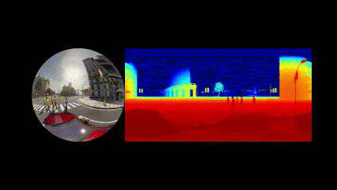

*This documentation is translated by chatGPT, a language model developed by OpenAI.*

**Version preview-1.0**

# 1 Introduction

 
 

This project is based on the open-source project [Carla](http://carla.org/), with the aim of helping people collect heterogeneous multi-viewpoint depth datasets, such as panoramic cameras, fisheye cameras, pinhole cameras, etc., including depth images from these cameras, for the purpose of creating autonomous driving datasets. The code for this project was written based on the API documentation and examples provided by [Carla](http://carla.org/).

# 2 Features
This project includes the following features:

1. Collect RGB images and corresponding depth images from different camera models.
2. These cameras can be synchronized to capture continuous frame images, and their positions, timestamps, etc. can be recorded.
3. Tools are provided to convert cubemap images into panoramic and fisheye images.
4. A simple script for recording carla scenes is also provided.

# 3 Usage
Before you start using this project, it is strongly recommended that you read the official documentation of [Carla](http://carla.org/) and familiarize yourself with the use of the API. This will make it easier for you to get started with this project. 

Additionally, [PyTorch](https://pytorch.org/) is used for image post-processing steps in this project, so if you do not have [PyTorch](https://pytorch.org/) installed, please make sure to install it.

# 4 Further Work

1. Add depth images for fisheye camera models. 
2. Add detailed usage documentation for this project.

# 5 ChangeLogs

Init preview-1.0 version. There is no detailed user manual for this version yet, and it has not been tested by other users.

