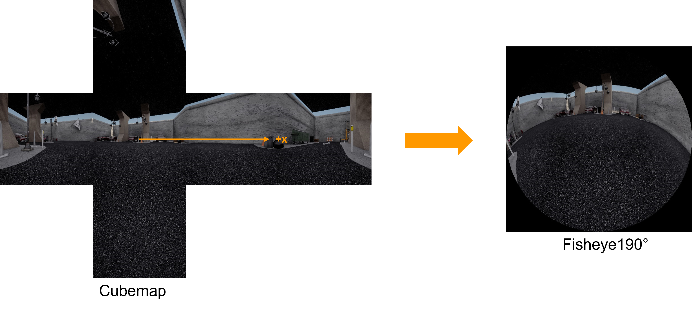
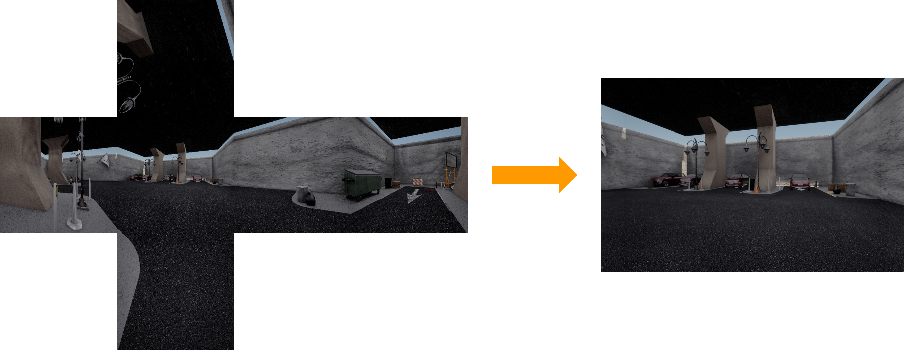

# 数据后处理脚本使用说明

## 0 数据后处理流程
&emsp;&emsp;从模拟器中采集的原始数据为cubemap图像，也就是说一个图像传感器对应六个面，需要根据需要将cubemap转换为所需的鱼眼、针孔相机等。

## 1 cubemap转为erp
```bat
set ROOT_PATH=output/huawei_parking06
python tools/cubemap2erp.py     --external_path "%ROOT_PATH%/external.txt"^
                                --cubeW 2560^
                                --format "npz"^
                                --cubemap_dir "%ROOT_PATH%/cubemap"^
                                --output_dir "%ROOT_PATH%/erp"^
                                --camera "cm_depth0"^
                                --use_cuda
```
><font color='yellow'><b>external_path</b></font>&emsp;
><font color='gree'><b>包含数据帧数相关数据，若使用run.bat脚本会自动生成</b></font><br>
><font color='yellow'><b>cubeW</b></font>&emsp;
><font color='gree'><b>cubemap宽度，固定为2560</b></font><br>
><font color='yellow'><b>format</b></font>&emsp;
><font color='gree'><b>数据格式，rgb图像使用jpg，depth图像使用npz</b></font><br>
><font color='yellow'><b>cubemap_dir</b></font>&emsp;
><font color='gree'><b>保存原始cubemap目录</b></font><br>
><font color='yellow'><b>output_dir</b></font>&emsp;
><font color='gree'><b>输出目录</b></font><br>
><font color='yellow'><b>camera</b></font>&emsp;
><font color='gree'><b>相机名称，与配置文件中传感器名字对应</b></font><br>
><font color='yellow'><b>use_cuda</b></font>&emsp;
><font color='gree'><b>使用gpu进行转换</b></font><br>

## 2 cubemap转fisheye

```bat
set ROOT_PATH=output/huawei_parking06
python tools/cubemap2fisheye.py     --fov 190^
                                    --cubeW 2560^
                                    --outW 2560^
                                    --r_x 30^
                                    --external_path "%ROOT_PATH%/external.txt"^
                                    --cubemap_dir "%ROOT_PATH%/cubemap"^
                                    --output_dir "%ROOT_PATH%/fisheye190"^
                                    --camera "cm_rgb9"^
                                    --use_cuda
```
><font color='yellow'><b>r_x</b></font>&emsp;
><font color='gree'><b>鱼眼光心绕X轴旋转角度，顺时针为正</b></font><br>
><font color='yellow'><b>fov</b></font>&emsp;
><font color='gree'><b>指鱼眼相机的水平FOV</b></font><br>
><font color='yellow'><b>use_cuda</b></font>&emsp;
><font color='gree'><b>使用gpu进行转换</b></font><br>

## 3 cubemap转erp

```bat
set ROOT_PATH=output/huawei_parking06
python tools/cubemap2pinhole.py     --fov 100^
                                    --cubeW 2560^
                                    --outH 1856^
                                    --outW 2880^
                                    --external_path "%ROOT_PATH%/external.txt"^
                                    --cubemap_dir "%ROOT_PATH%/cubemap"^
                                    --output_dir "%ROOT_PATH%/pinhole"^
                                    --camera "cm_rgb1"^
                                    --use_cuda
```
><font color='yellow'><b>outH</b></font>&emsp;
><font color='gree'><b>输出的针孔相机图像高度</b></font><br>
><font color='yellow'><b>outW</b></font>&emsp;
><font color='gree'><b>输出的针孔相机图像宽度</b></font><br>

## 4 使用post.dat脚本进行后处理

```bat
./scripts/win/post.bat [版本] [场景名]
```
执行此脚本，会自动转换对应原始场景cubemap为版本需要的图像，例如当我们采集使用run.bat脚本采集完huawei_parking06场景，则只需在工程根目录下执行 ***./scripts/win/post.bat huawei parking06***。