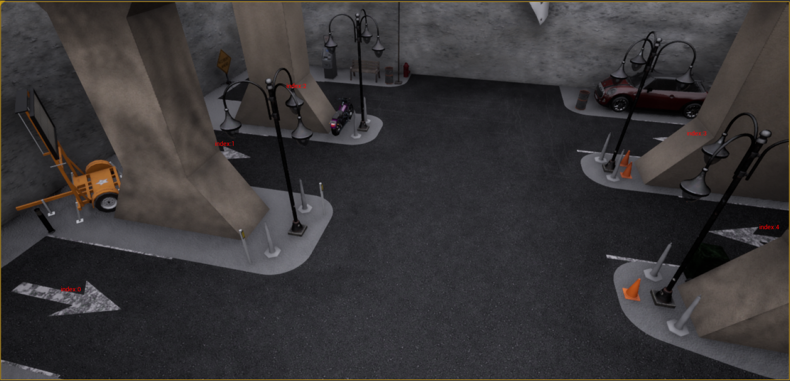

# 数据采集脚本使用说明

    本文档介绍如何使用已有采集脚本采集原始cubemap数据，包含场景和传感器设置，分步骤采集等。

## 0 场景中的spawn_point
>&emsp;&emsp;我们使用ue4编辑器打开一个地图并运行，可以使用*tools/vis_spawn_points.py*脚本在编辑器中显示可用的spawn_point的序号，这些点即为可以设置的车辆重生点。车辆的类型一共为两种*hero*和*npc*，*hero车辆*即为搭载传感器车辆，另一种为场景中的npc。关键字*hero_actor*控制*hero*的属性，详情如下：
>
>```json
>"hero_actor":{
>   "blueprint":"vehicle.audi.invisiable",      //车辆蓝图
>   "autopilot":true,                           //自动驾驶
>   "tm_port":8000,                             //TrafficManager端口号
>   "ignore_lights_percentage":0.0,             //忽略交通指示灯
>   "random_left_lanechange_percentage":0.0,    //随机向左变道
>   "random_right_lanechange_percentage":0.0,   //随机向右变道
>   "auto_lane_change":false,                   //自动变道
>   "spawn_points_index":3,                     //重生点序号，可以使用vis_spawn_points.py获取
>   "spawn_points":{},                          //暂时忽略
>   "desired_speed":2.5,                        //车辆速度
>   "route_indices":[],                         //暂时忽略
>   "route_points":[]                           //暂时忽略
>}
>```
>&emsp;&emsp;以SimpleInnerParking地图为例，执行python tools/vis_spawn_points.py，图中显示了车辆可以重生的位置。
>
---
<br>

## 1 场景设置文件（json）使用说明

### **1.1 命名方式**

>&emsp;&emsp;本项目场景设置文件采用的名为方式为 **[*版本名称*]\_[*场景名称*]\_part[*X*].json**，因为同时同时采集所有传感器资源消耗巨大，因此采用分布采集方式。

&emsp;&emsp;如下表所示，huawei版本分为4步采集；nju版本分为3步采集。
| 版本 | json文件 | 传感器 |
| ---- | ---- | ---- |
| huawei | huawei_parking01_part1.json | cm_rgb8; cm_rgb11; cm_rgb13; cm_depth0; |
| huawei | huawei_parking01_part2.json | cm_rgb9; cm_rgb10; cm_rgb12; |
| huawei | huawei_parking01_part3.json | cm_rgb2; cm_rgb4; cm_rgb5; |
| huawei | huawei_parking01_part4.json | cm_rgb1; cm_rgb7; cm_rgb6; |
| nju | nju_parking01_part1.json | cm_rgb0; cm_rgb1; cm_rgb2;|
| nju | nju_parking01_part2.json | cm_rgb7; cm_rgb3; cm_depth0;|
| nju | nju_parking01_part3.json | cm_rgb6; cm_rgb5; cm_depth4;|

### **1.2 json文件基本设置**

```json
{
    "random_seed": 88, //随机数种子，保证场景可复现
    "ignore_frames":5, //采集开始时忽略前5帧
    "save_frames":200, //单场景保存的帧数
    "scene_config":{
        "map": "SimpleInnerParking", // 地图名
        "sync_mode":true, //采集时要开启数据同步模式
        "fixed_delta_time":0.05,
        "traffic_mananger_setting":[ 
            {
                "port":8000,
                "random_device_seed":12,
                "global_distance_to_leading_vehicle":1.0
            }
        ],
        "hero_actor":{...}, // 详见 0 场景中的spawn_point
        "vehicle_npc":[...], //详见 1.4 场景配置文件中车辆npc的设置
        "walker_npc":[] // TODO
    },
    "sensor_config":{...}   //详见 1.3 json文件中的传感器设置
}
```

### **1.3 json文件中的传感器设置**

>&emsp;&emsp;打开场景设置文件，找到*sensor_config*关键字，通过编辑该关键字内容来进行传感器设置，我们只需关注其中的*cubemap_rgb*和*cubemap_depth*关键字即可。*cubemap_rgb*和*cubemap_depth*关键字二者内容为列表(list)，向其添加json字段可以进行传感器设置。
>
>&emsp;&emsp;以huawei_parking06_part01.json内容为例，*cubemap_rgb*包含了cm_rgb8、cm_rgb11、cm_rgb13传感器；*cubemap_depth*包含了cm_depth0传感器。下图为上述传感器cm_rgb8在汽车上安放位置，以及相机朝向。
>
><font color=gree>rotation_yaw=0时相机朝向与车头（+x方向）保持一致，若想要相机拍摄车右边即rotation_yaw=90，左边为rotation_yaw=-90</font>

```json
"sensor_config":{
    "cubemap_rgb":[
        {
            "name" : "cm_rgb8",
            "location_x":-2.5,  //以汽车为中心在x轴上位置，单位为m。
            "location_y":0,     //以汽车为中心在y轴上位置，单位为m。
            "location_z":1.1,   //以汽车为中心在z轴上位置，单位为m。
            "rotation_yaw":180, //以z轴旋转，顺时针为正方向，单位为°。
            "image_width":2560, //cubemap图像宽度 （长宽相等）
            "fov":90,           //cubemapFOV 90°，常量
            "sensor_tick":0.0   //不要改变此关键字值
        },
        {
            "name" : "cm_rgb11",
            "location_x":-2.5,
            "location_y":0,
            "location_z":0.6,
            "rotation_yaw":180,
            "image_width":2560,
            "fov":90,
            "sensor_tick":0.0
        },
        {
            "name" : "cm_rgb13",
            "location_x":-2.5,
            "location_y":0,
            "location_z":0.8,
            "rotation_yaw":180,
            "image_width":2560,
            "fov":90,
            "sensor_tick":0.0
        }
    ],
    "cubemap_depth":[
        {
            "name" : "cm_depth0",
            "location_x":0,
            "location_y":0,
            "location_z":1.0,
            "rotation_yaw":0,
            "image_width":2560,
            "fov":90,
            "sensor_tick":0.0
        }
    ],
    "pinhole_rgb":[],
    "pinhole_depth":[]
}
```
>**huawei版本传感器设置**

>**nju版本传感器设置**

### **1.4 场景配置文件中车辆npc的设置** 
>&emsp;&emsp;json文件中，关键字*vehicle_npc*控制车辆npc生成，向列表中添加内容即可在场景中设置特定npc。以*huawei_parking06_part1.json*中的npc设置为例:
>```json
>"vehicle_npc":[
>   {
>       "random_bluerint":false, //当为true时，随机选取车辆蓝图，同时禁止"blue_print"关键字
>       "blueprint":"vehicle.audi.a2",
>       "spawn_points_index":1, //车辆生成的spawn_point的序号
>       "autopilot":false, 
>       "tm_port":8000
>   },
>   {
>       "random_bluerint":false,
>       "blueprint":"vehicle.audi.a2",
>       "spawn_points_index":2,
>       "autopilot":false,
>       "tm_port":8000
>   },
>   {
>       "random_bluerint":false,
>       "blueprint":"vehicle.audi.a2",
>       "spawn_points_index":3,
>       "autopilot":false,
>       "tm_port":8000
>   },
>   {
>       "random_bluerint":false,
>       "blueprint":"vehicle.audi.a2",
>       "spawn_points_index":4,
>       "autopilot":false,
>       "tm_port":8000
>   },
>   {
>       "random_bluerint":false,
>       "blueprint":"vehicle.audi.a2",
>       "spawn_points_index":5,
>       "autopilot":false,
>       "tm_port":8000
>   }
>]
>```
>&emsp;&emsp;

## 2 使用run.bat脚本采集数据

```
./scripts/win/run.bat [版本] [场景名] [进程数（一般设为2）]
```
场景文件夹放在工程根目录output文件夹中，命名方式为***版本_场景名***，文件夹中包含相应的场景配置文件，以huawei版本、parking06为例，文件树为
```
heterogenenous-data-carla-main/
---docs
---scripts
---tools
---template_configs
---utilities
---output/
    ---huawei_parking06/
        ---huawei_parking06_part1.json
        ---huawei_parking06_part2.json
        ---huawei_parking06_part3.json
        ---huawei_parking06_part4.json
```
执行 <font color=yellow><b><i>./scripts/win/run.bat huawei parking06 2</i></b></font> 命令即可，采集完后，huawei_parking06文件夹内会生成external.txt和cubemap文件夹，pinhole文件夹可以忽略。cubemap文件夹中保存原始cubemap数据，external.txt记录车辆外参。

