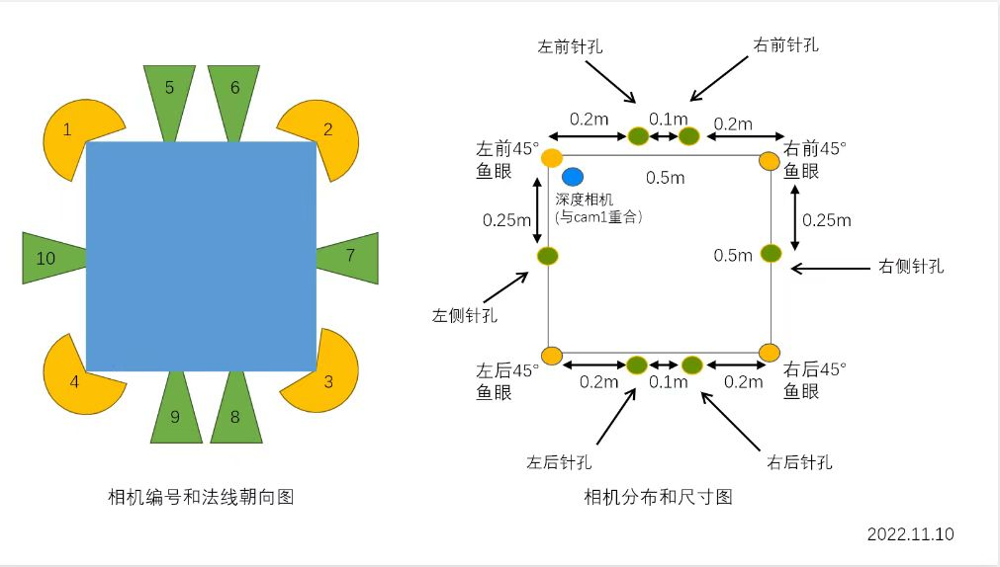

# 原始数据格式使用说明



## 0 目录树

```sh
-output_data/
--pinhole/ #保存针孔相机数据    
--cubemap/ #保存Cubemap相机数据
```

## 1 针孔相机

命名方式: ph_[cam_id]_[frame]_[timestamp].jpg

| 相机 | 对应图中标号 |
| :----: | :----: |
| ph_rgb1 | 5 |
| ph_rgb2 | 6 |
| ph_rgb3 | 9 |
| ph_rgb4 | 8 |
| ph_rgb5 | 7 |
| ph_rgb6 | 10 |

## 2 Cubemap相机

命名方式: cm_[cam_id]_[view（cubemap视角6个面）]_[frame]_[timestamp].jpg

| 相机 | 对应图中标号 |
| :----: | :----: |
| cm_rgb1 | 1 |
| cm_rgb2 | 2 |
| cm_rgb3 | 3 |
| cm_rgb4 | 4 |
| cm_depth | depth |

## 3 数据集采集随机数设置

| data_name      | map | random seed     | tm set_random_device_seed |
| :---        |    :----:   |    :----:    |    :----:   |
| 1    | Town01        | 5   |  54  |
| 2    | Town02        | 5   |  54  |
